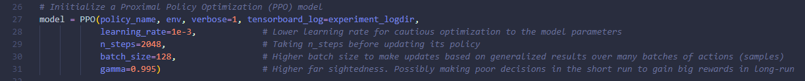
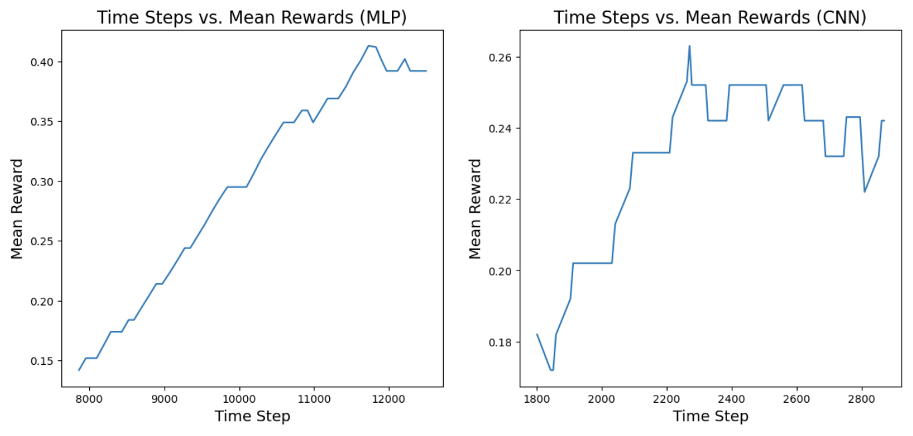
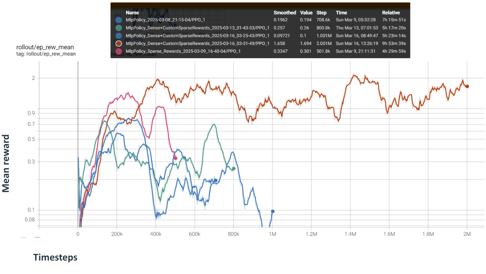
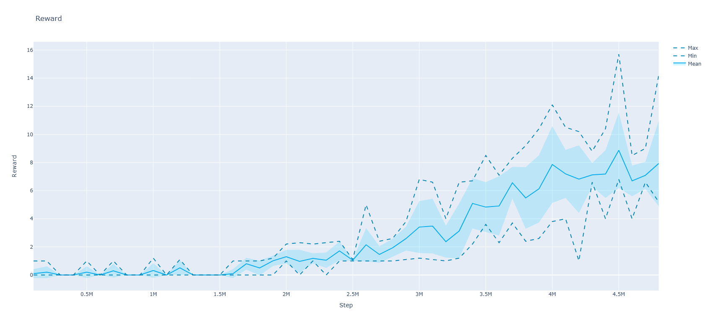
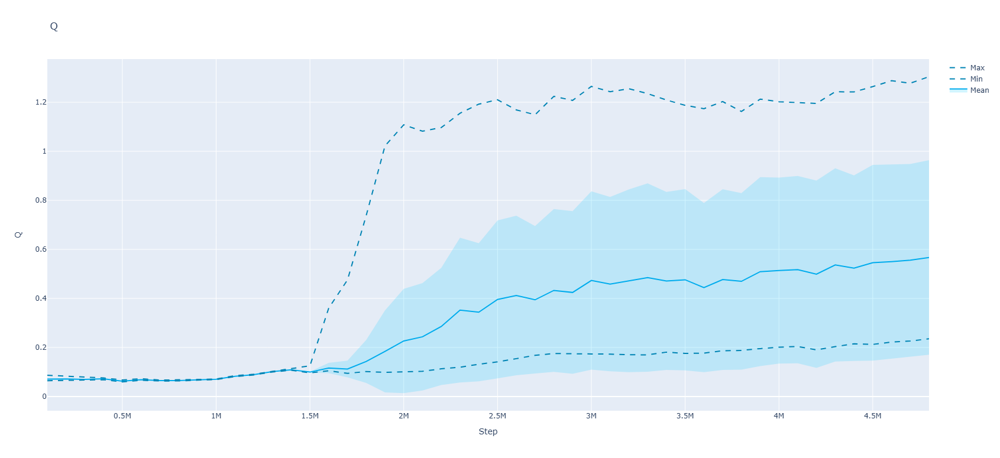
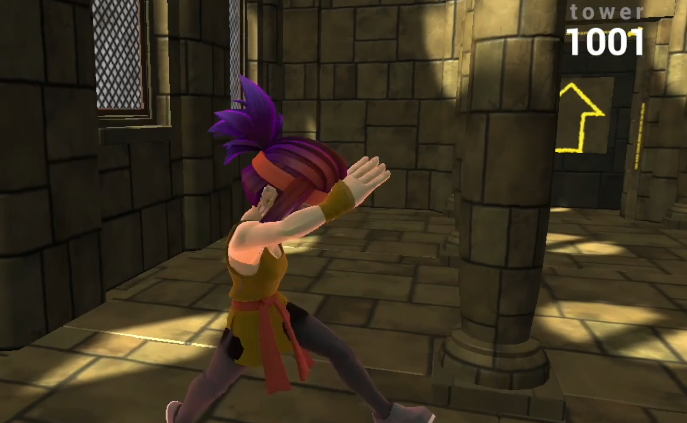

## Video

### [Full Video](https://www.youtube.com/watch?v=ZI62ny0AzuY)

## Project Summary
The Unity Obstacle Tower is a challenging, procedurally generated environment developed for AI research, designed to test the capabilities of agents in computer vision, control, planning, and generalization. The goal is to build agents that can learn to solve puzzles, navigate through dynamic environments, and make decisions under sparse and delayed reward structures, all while attempting to climb as many floors as possible within a limited time.

I worked independently on developing a reinforcement learning agent to navigate the Obstacle Tower environment. The agent's overarching objective was to ascend as many floors as possible by solving puzzles, collecting keys, and overcoming dynamically generated obstacles. Each floor presents increasing difficulty, requiring the agent to demonstrate adaptability and long-term planning in a sparse-reward setting.

The difficulty of this task lies in the environment's sparse rewards and the randomness of the layout. Reinforcement learning (RL) agents require feedback to evaluate and improve their behavior, and in Obstacle Tower, such feedback is infrequent. The agent must figure out how to identify important items (e.g., keys, doors), avoid obstacles, and solve floor-specific challenges while maximizing rewards within limited time.

## Approaches

### PPO and Randomized Action (baseline approaches)
I began with a baseline model using a Random Policy, which sampled actions arbitrarily without training. This allowed me to observe the agent's action space, consisting of 54 discrete combinations of movement:
* Move forward, backward, no move
* Move left, right, no move
* Turn left, right, no turn
* Jump, no jump

As expected, the random agent performed poorly, often getting stuck or moving incoherently.

Next, I trained a model using the Proximal Policy Optimization (PPO) algorithm from the stable-baselines3 library. I experimented with both Multi-layer Perceptron (MLP) and Convolutional Neural Network (CNN) policies. Given that the observation space is an 84x84 RGB image, the CNN policy was more suitable for capturing spatial information such as terrain, doors, and keys. PPO's on-policy nature allowed the agent to continuously update based on the most recent experiences, making it more adaptable to the Tower's dynamic changes.

### Improving Upon PPO With Reward Shaping
To guide the agent's learning, I implemented reward shaping—rewarding actions such as collecting keys or ascending floors. While this initially improved learning, the agent still struggled with efficient pathfinding. I experimented with hyperparameter tuning, settling on configurations that provided more consistent results across training sessions, each lasting 2 million timesteps.

### Ideas of Incorporating Computer Vision
The idea came from most of the map is quite dull, except the doors which are bright colors, whether yellow, green, or red. I considered using a vision-based approach. The plan was to integrate ResNet from PyTorch to allow the agent to prioritize moving toward such features. However, training these models proved computationally expensive and was ultimately infeasible within the time and hardware constraints.

### Rainbow DQN
To address PPO's limitations, I implemented the Rainbow Deep Q-Network (DQN), which integrates six key improvements:
* Double DQN to reduce overestimation bias.
* Prioritized Experience Replay to focus on critical experiences like collecting keys.
* Dueling Network Architecture to separate state value from action advantages.
* Multi-step Learning for faster reward propagation.
* Distributional RL for better uncertainty modeling.
* Noisy Networks for improved exploration.
These improvements made Rainbow DQN well-suited for the sparse-reward and dynamic environment of Obstacle Tower.

## Evaluation

### Quantitative Metrics
I tracked the following during training:

- Average Episode Reward to monitor learning progress.
- Episode Length as a proxy for survival and efficiency.
- Generalization Performance by testing on unseen tower seeds.

I found that CNN-based PPO outperformed the MLP variant in feature extraction, although both struggled with consistent navigation. However, PPO with reward shaping reached an average reward above 2 by 2 million timesteps—indicating consistent access to the second floor.

**MLP and CNN Model**
The initial naive MLP and CNN policy model's performance

After setting up PPO with rewards, although slow, we did see a great jump in the average episode reward. Instead of remaining below 1, signifying the agent was often stuck trying to get up to the 1st floor from floor 0, the agent was now averaging well above 1, and for a short period of time around 1.5 million timesteps, it was averaging above 2. This shows that the agent was consistently getting to the 2nd floor, and gained even more rewards after that. This means that the agent was gaining rewards from the 2nd floor completing puzzles, or it was occasionally make it to the 3rd floor as well.

**Rainbow DQN**
I trained the Rainbow DQN for 5 million timesteps (took about ~5 days) and evaluated performance by logging average episode rewards and Q-values. The agent initially performed poorly but began to show improvement around 1.5 million timesteps, reaching an average reward of 8.87 by 4.5 million timesteps, consistently clearing 6+ floors per episode.

The Q-values serve as a proxy for the agent's estimated future rewards. The rising Q-values aligned with increased rewards, suggesting the agent gained confidence and policy stability over time.

Initially, the agent struggled to make progress, with average rewards remaining close to zero for the first 1.5 million timesteps. This was expected due to the sparse reward structure of the environment. However, a notable breakthrough occurred at around 1.5 million timesteps, where the agent's average reward began to increase, reaching 0.80 at 1.7M and 1.30 at 2.0M timesteps. This suggests that the agent successfully explored its environment and learned effective policies for clearing early floors.

The alignment between the rising average rewards and Q-values strongly suggests that the agent developed a meaningful policy for navigating the environment and achieving consistent progress. The breakthrough around 1.5M timesteps highlights the importance of exploration in environments with sparse rewards. Once the agent discovered reliable strategies for completing floors, its learning accelerated, reflected in the steep increase in both rewards and Q-values.

The Rainbow DQN implementation demonstrates a substantial improvement over our initial PPO baseline, which failed to clear even a single floor consistently. Through a combination of prioritized replay, multi-step learning, and noisy networks, our Rainbow DQN agent learned to tackle the exploration problem of Obstacle Tower. The final agent achieved an average reward of 8.87, translating to 6 floors cleared on average, with peak runs exceeding this.

### Qualitative Analysis

Earlier PPO and random policy models frequently got stuck or looped around rooms aimlessly. Screenshots show examples of the agent failing to enter doors or wandering off-course.

Newer PPO with reward shaping and Rainbow DQN models showed substantial improvements. The PPO agent occasionally reached floor 3, while the Rainbow DQN agent sped through floors 0-7, only getting stuck at floor 8 due to the need to retrieve a key that wasn’t in its direct path—highlighting a gap in learned backtracking behavior. Further training, beyond the truncated 5 million timesteps (original goal: 50 million), remains critical.

### Resource Constraint
Despite time constraints limiting full-scale training, the results validate the effectiveness of advanced RL algorithms in sparse-reward settings and highlight promising directions for future expansion. Notably, had I been able to reach my original target of 50 million training timesteps, I believe the agent could have learned even more sophisticated behaviors such as backtracking for keys, adapting to new puzzle types, and reliably climbing into double-digit floors. This potential for further improvement opens the door for additional research and experimentation.

## Conclusion
This project successfully demonstrated the development and improvement of a reinforcement learning agent capable of navigating the highly complex and procedurally generated Obstacle Tower environment. Through iterative experimentation and progressive model enhancements—from random policy baselines to PPO with reward shaping and finally to Rainbow DQN—I achieved measurable improvements in agent behavior and performance. The final Rainbow DQN model achieved an average episode reward of 8.87, consistently clearing 6 or more floors, and demonstrated clear learning milestones through increased Q-values and improved navigation. Despite time constraints limiting full-scale training, the results validate the effectiveness of advanced RL algorithms in sparse-reward settings and highlight promising directions for future expansion. This project not only provided a robust learning experience in reinforcement learning and vision-based AI but also yielded an agent that meaningfully engaged with the environment and improved in a measurable, impactful way.

## References
- [Obstacle Tower GitHub Repository](https://github.com/Unity-Technologies/obstacle-tower-env)
- [Obstacle Tower: A Generalization Challenge in Vision, Control, and Planning](https://arxiv.org/abs/1902.01378)
- [PPO Dash: Improving Generalization in Deep Reinforcement Learning](https://arxiv.org/abs/1907.06704)
- [Trying to navigate in the Obstacle Tower environment with Reinforcement Learning](https://smartcat.io/tech-blog/data-science/trying-to-navigate-in-the-obstacle-tower-environment-with-reinforcement-learning/)
- [ResNet Deep Learning: PyTorch Documentation](https://pytorch.org/vision/main/models/resnet.html)
- [Reinforcement Learning in Practice – Obstacle Tower Challenge](https://neurosys.com/blog/reinforcement-learning-obstacle-tower-challenge-2)
- [Rainbow: Combining Improvements in Deep Reinforcement Learning](https://github.com/Kaixhin/Rainbow)

## AI Tool Usage
During development, I used ChatGPT to better understand and implement advanced reinforcement learning algorithms. It served as a helpful tool for breaking down complex ideas, such as Rainbow DQN components or PPO hyperparameters. When experimenting with reward shaping, I used ChatGPT to validate strategies and mitigate unintended behaviors, helping me focus efforts more efficiently.

